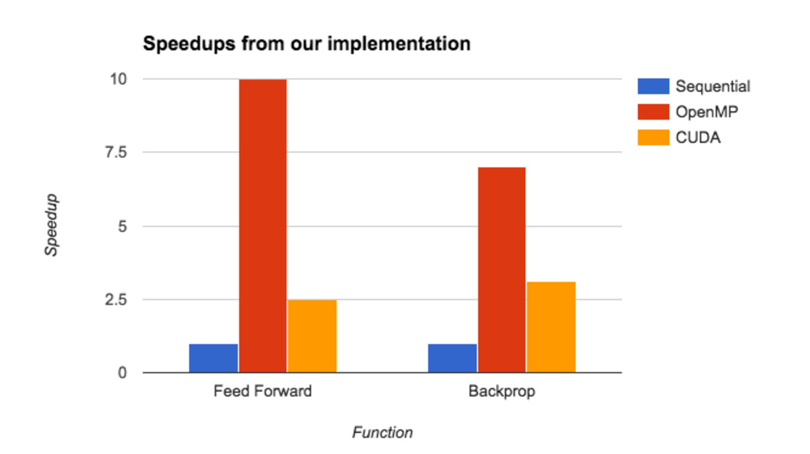
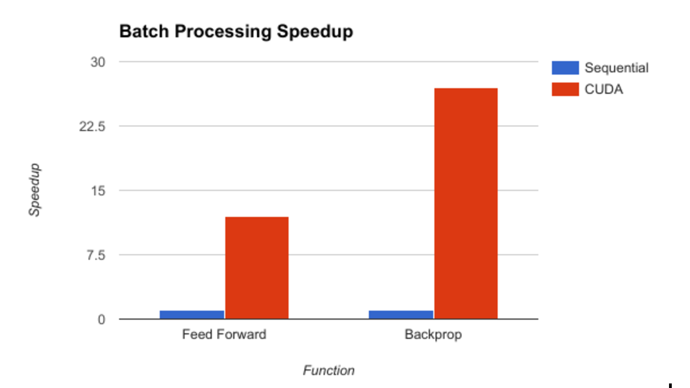

# Parallelizing a Deep Neural Network

### FINAL REPORT
We implemented the parallelization of the training stages of a deep neural network to classify handwritten digits from the MNIST dataset. We looked at what sort of workloads we need to have in order to well utilize both multi-core parallelism using OpenMP and leverage multiprocessors on the GPU using CUDA. We also looked at optimizing our parallelism using batch processing, where we feed a group of images through the network at once and consequently update the weights using the delta errors that we accumulate from the batch. While our OpenMP implementation did well in comparison to the sequential version, achieving a 10x speedup in feed-forward and 7.5x speedup in backprop, our CUDA implementation did not start to show its true potential until after we implemented batch processing, where it achieved a 10x speedup in feed-forward and 28x speedup in backprop compared to the sequential version.

**Background**
A neural network is a machine learning structure containing layers of nodes that are connected to each other. This includes the input layer, the hidden layer(s), and the output layer. The forward propagation algorithm is used to feed the input forward through the net and compute posteriori probabilities for its output nodes, given the input. The backpropagation algorithm is used to compare this predicted output to the expected output, and accordingly adjust the weight matrices. Even though there are sequential dependencies between each layer in the network, since the computation depends on the results of the previous layer, neurons in each layer are independent from each other so their computations can be done in parallel.

The diagram above shows the typical process for classifying images from the MNIST dataset. We used a fully connected hidden layer to classify each MNIST image. Each image is a 28x28 pixel image, forming a 784 long array in each row of our input matrix. The MNIST dataset has 60,000 labeled observations in the training set and 10,000 testing images. We used the sigmoid function as our activation function for the hidden and output neurons, and stochastic gradient descent to adjust our weights. This combination also allowed us to not get stuck in local minimums when trying to minimize our error while training. 

There is a need for neural networks to be computationally efficient so that we are able to train and use very powerful classifiers without having to sacrifice a great deal of time to waiting for them to be developed. Thus, we wanted to find fundamental parts of the algorithm in both forward and back propagation steps where there are bottlenecks due to naive sequential code, and attempt to parallelize these aspects. This included the matrix multiplications in feed-forward and the process of computing error gradients and deltas in backpropagation. 

**Approaches** 
Our approach focused on three different implementations exploiting data parallelism in our neural net, namely multi-core, multiprocessors on the GPU, and batch processing. We used the GHC cluster machines as the platform to execute our implementations on. We did this to utilize their 8 core, 2-way hyperthreading, i7 Xeon processors as well as the NVIDIA GeForce GTX 1080 GPU. This allowed us to implement parallelization on the GPU through CUDA, and use OpenMP to parallelize across the 16 execution contexts.

#### OpenMP
Our first approach was to use multi-core parallelism with OpenMP.  In the feed-forward algorithm, we parallelized the matrix multiplications between the layers. We essentially computed the resultant product matrix by computing the dot product of the input vector with each column in the weights matrix. We launched 16 threads evenly distributed across the number of hidden units and used OpenMP for reduction to sum over these element-wise products. In backpropagation, we computed the error gradients and stored the deltas in parallel for each layer. We then updated the weight matrices in parallel as well. 

#### CUDA 
Our second approach was to leverage the power of the GPU with CUDA. We first did this with matrix multiplications in feed-forward. Our initial attempt to parallelize matrix multiplication was to create a very large array of dimensions corresponding to the sizes of the layers being considered in the current activation stage. To exemplify, we can consider the step of feeding the input vector through the hidden layer, resulting in a vector-matrix multiplication of sizes (1 x (nInput+1)) and ((nInput+1) x nHidden), where nInput = 784, and nHidden (the number of hidden units) was varied over implementations. Thus, this outputs the resultant product vector of size (1 x (nHidden)). 

We then launched a CUDA kernel where each thread fills in a single element in this array, by performing the appropriate multiplication of its assigned elements from the input vector and the first weights matrix. The Thrust library’s segmented scan was then applied on the result and the relevant elements were extracted and stored as the hidden neuron values. After timing this implementation, we saw we did not do much better than the sequential implementation and so we decided to switch to a shared-memory based scan, which we expected would be faster.

This implementation used similar techniques as the previous but now we launched nHidden thread blocks of size 1024, with each block corresponding to a unit in the hidden layer. Thus, each block was responsible for computing the dot product of the input vector and its corresponding hidden unit column vector. We used the shared memory exclusive scan from Assignment 2  to compute the sum of the element-wise products of the vectors. We used a similar methodology for backpropagation, where we assigned a thread block to every hidden unit and launched CUDA kernels to compute the error gradients and deltas for each layer

After this, we found better speedup compared to our sequential implementation but still could not compare to the multi-core CPU implementation. We realized that the overhead of launching kernels and copying data between the host and device was still outweighing the benefits of using the GPU with our workload. The matrix multiplication was still not compute intensive enough for the sizes we were dealing with, since we were still using 50 hidden units. Thus, we increased our number of hidden units to 200 then 700, and this seemed to be more suited to leverage the GPU’s power and lead to a better speedup. 

#### Batch Processing
In order to better utilize the multiprocessors in the GPU, we decided to process images in batches. We processed 32 images at a time, with each input connecting to 32 hidden units as ~30 units suffices to achieve 95% accuracy with the MNIST dataset. Consequently, we would be launching 1024 blocks with 1024 threads each. This approach allowed us to increase compute intensiveness and only launch two kernel calls in both forward and backprop for every 32 
images, instead of two for each image in both functions. This further optimization also helped reduce the sequential dependencies that existed between each training observation, since we didn’t have to wait for each image to be processed before moving to the next one.

For feed-forward, our kernel functions remained similar to our original CUDA implementation when we processed one image at a time. Each thread block corresponds to a hidden unit that corresponds to its respective image. We stored the resultant vectors in a large array scaled for our batch size. Essentially, we are now computing a large matrix-matrix multiplication instead of a vector-matrix multiplication as before. For backpropagation, we take the result of feed-forward after having fed 32 images, and launch kernel calls to compute their error gradients and accumulate their deltas with an atomicAdd (just 32 additions). We then only updated the weight matrices using these accumulated deltas after each batch. 

We witnessed a much better speedup compared to the sequential version with this approach. This exposed the fact that having a large enough workload and compute intensiveness is needed to warrant the utilization of a GPU.

**Results**
We were successful in achieving all of our initial plans for the project as well as half of our hopes to achieve. We managed to achieve speedup proportional to the number of cores on the machine (8) when using OpenMP, predict MNIST images with an error rate of less than 5%, use both OpenMP and CUDA kernel calls to exploit data parallelism available to us, use batch processing to improve throughput of the network and further leverage the GPU, and use a shared memory model to improve the latency of memory accesses.

Our input size was kept consistent with 60,000 training images, each of size 784 (28x28), and 10,000 test images. We measured our performance using both speedup against the sequential version of our code, as well as an application specific seconds/iteration where we timed how long it took for our neural net to do 1 complete sweep of all the training observations.

The graph above illustrates the speedups we achieved across the different mediums of parallelism, using 700 hidden units in our hidden layer. We see that OpenMP does consistently better than CUDA for this workload, in both feed-forward and backprop. After profiling our functions, we found this to be due to the fact that we are making 2 CUDA kernel calls for every image, in each function. Even though we increased our overall computation with larger matrices, the overhead of launching these kernels and copying this amount of data still outweighs the speedup of computation. 

OpenMP still performs better as we only launch 16 threads over the 700 hidden units, and even though each thread is performing more work, the time to compute vector dot products is very small. Thus our workload is not significant enough yet to necessitate the use of CUDA kernels and the CUDA speedup vs our sequential implementation is just around 3x. We see that in backprop, OpenMP does not perform better than the sequential version by as large a factor as in feed-forward, whereas the speedup for CUDA improves. This is consistent with our line of thinking in that CUDA needs a more compute intensive task to be as effective, and not be bandwidth bound by the overhead of memory copies.

As we mentioned before, processing multiple images in parallel enabled us to increase compute intensiveness and finally warrant the overhead of launching CUDA kernels and leverage the GPU to achieve great speedup. Now we only have two kernel calls in each function for every 32 images, rather than every 1 image. Compared to the sequential versions, this implementation resulted in a 10x speedup for feed-forward and a 28x speedup for backpropagation. 

To wrap up, we wanted to compare our CUDA implementation across functions to some well defined baselines. We did this by substituting our matrix multiplication kernel in feed-forward with cuBLAS matrix multiplication function. After timing one iteration, we observed that our implementation took less time than that using cuBLAS. However, cuBLAS scales better as we increase number of hidden units. 

It was surprising to us to see our CUDA implementation complete an iteration faster than using cuBLAS, which is one of the fastest GPU based matrix multiplication libraries out there. There are 2 possible reasons we think this could be the case. The first is that cuBLAS requires a certain threshold of compute intensiveness to start outperforming any other sort of implementation. This would be supported by the fact cuBLAS seems to scale better to greater numbers of hidden units than we do, since the factor by which its computation time increases is much smaller than that of ours. 

The second reason that we found after inspecting our code was that there is an extra step of initializing a handle for cuBLAS that is being done in every call to feed forward. This also causes a slight slow down since we do all of our CUDA initialization in the class constructor, which unfortunately isn’t possible with a cuBLAS handle as the cuBLAS library cannot be imported into a header file.

**References**
Dahl, George, Alan McAvinney, and Tia Newhall. “Parallelizing neural network training for cluster systems.” Proceedings of the IASTED International Conference on Parallel and Distributed Computing and Networks. ACTA Press, 2008. https://www.cs.swarthmore.edu/~newhall/papers/pdcn08.pdf

Krizhevsky, Alex. “One weird trick for parallelizing convolutional neural networks.”. eprint arXiv:1404.599. 2014. https://arxiv.org/pdf/1404.5997.pdf

Podlozhnyuk, Victor. “Image Convolution with CUDA.” http://developer.download.nvidia.com/assets/cuda/files/convolutionSeparable.pdf

Pethick, Mark, Michael Liddle, Paul Werstein, and Zhiyi Huang. “Parallelization of a Backpropagation Neural Network on a Cluster Computer.” 2003. http://www.cs.otago.ac.nz/staffpriv/hzy/papers/pdcs03.pdf

**Work performed by each student** 
Equal work was performed by both project members.

### CHECKPOINT REPORT

As of April 24, we have completed the first task of our project as stated on the proposal, which was to implement a working sequential version of our neural network trained on the MNIST handwritten image database. 
After coding a working version in Python and determining the optimal number of hidden units and the learning rate to classify handwritten images with 95% accuracy, we implemented a working C++ version. We also achieved this accuracy with the C++ version, which is beyond our initial plans for the project. Thus, we have all of our baseline code to make comparisons to, for us to use to measure speedup as we start parallelizing. We also have more advanced models if we choose to make those comparisons.

With regard to our goals and deliverables stated in the proposal, our next task is to parallelize the matrix multiplications involved in training the neural network. We are about a day behind on this. We believe that we will still be able to complete the proposed deliverables that we "plan to achieve", and believe we will be able to complete half of what we "hope to achieve" or "nice to haves."

Our demo will include graphs reflecting the speedup and accuracy achieved by our parallel neural network. 

Possible issues we may encounter include finding the best places for parallelism, without introducing too much of an overhead of launching threads and thread synchronization/communication. We must be clever with the areas that we choose to focus on, since the neural net is largely sequential as we move through each hidden layer. Thus utilizing the GPU might be very useful, as we could perform optimized computation and try to get closer to peak possible execution on the machine.

We have updated our project schedule with a more detailed and revised plan of work for the coming weeks.

### PROJECT PROPOSAL
**Team members**: Abhy Vytheeswaran, Gaurav Lahiry 

**Summary**

We are going to implement a deep neural network using backpropagation to classify images. We want to use some combination of OpenMP and CUDA, as well as exploit the GPU, to speed up the training and testing phases of the network. We will compare our final implementation to a purely sequential algorithm and other existing models like Caffe.

**Background**

A neural network is a machine learning structure containing layers of nodes that are connected to each other. This includes the input layer, the hidden layers, and the output layer. Our neural network will use a backpropagation algorithm to adjust weights and output a label that predicts the class that a test image belongs to. Neurons in each layer are independent from each other so weights can be computed in parallel.

We will start with a single hidden layer and have a complete network where each layer is completely connected to the previous. We will use the sigmoid function as our activation function and stochastic gradient descent to compute the best way to adjust our weights. This combination will also allow us to not get stuck in local minimums when trying to minimize our error while training. We will train our network on the MNIST training set of 60,000 images of handwritten digits. We will then test it on 10,000 test images.  

There is a need for neural networks to be computationally efficient so that we are able to train and use very powerful classifiers without having to sacrifice a great deal of time to waiting for them to be developed. Thus, we want to find fundamental parts of the algorithm in both forward and back propagation steps where there are bottlenecks due to naive sequential code, and attempt to parallelize these aspects. In addition, it would be nice if we could use a trained model to classify large sets of unlabelled data, through further optimizations such as batch processing and filling up the GPU execution contexts available to us.

**Challenges** 

The challenge exists in the fact that a neural net is overall an iterative process that feeds weights forward through the network one hidden layer at a time, and then reverses the process to adjust the weights depending on which nodes in each layer contributed most to the error in our output. Thus we must find ways of parallelism for the work within each layer. This would mean taking advantage of whatever computations are being done naively that have the opportunity for speedup, such as matrix multiplications and mapping independent operations like applying activation functions to be done in parallel. 

However, each layer must be done sequentially, so we must be sure to synchronize threads in between, so there is an overhead of communication across threads within each layer. Furthermore, the weight matrices will be accessed frequently, which could potentially lead to false sharing, if we are not careful to make sure each thread doesn’t bring elements accessed by other threads up into their cache. 

Through this, we hope to learn the ideas behind parallelizing a neural network for efficient training and classification, as it is important that we are not limited by slow speeds as this would outweigh the benefits of having a more powerful deep learning classifier. In this way, we can get a deeper insight into how complex and efficient models like Caffe are implemented.

**Resources** 

Included are papers that we will refer to when implementing our parallel deep neural network. 

Dahl, George, Alan McAvinney, and Tia Newhall. "Parallelizing neural network training for cluster systems." Proceedings of the IASTED International Conference on Parallel and Distributed Computing and Networks. ACTA Press, 2008.  
https://www.cs.swarthmore.edu/~newhall/papers/pdcn08.pdf  

Krizhevsky, Alex. “One weird trick for parallelizing convolutional neural networks.”. eprint arXiv:1404.599. 2014.  
https://arxiv.org/pdf/1404.5997.pdf  

Podlozhnyuk, Victor. "Image Convolution with CUDA."  
http://developer.download.nvidia.com/assets/cuda/files/convolutionSeparable.pdf  

Pethick, Mark, Michael Liddle, Paul Werstein, and Zhiyi Huang. “Parallelization of a Backpropagation Neural Network on a Cluster Computer.” 2003.  
http://www.cs.otago.ac.nz/staffpriv/hzy/papers/pdcs03.pdf  

**Goals and Deliverables** 

Plan to achieve:
* Achieve linear speedup in training a neural network proportional to number of cores
* Accurate predictions when classifying test images (mean squared error < 20%) using at least 1 hidden layer and a simple sigmoid activation function
* Use OpenMP to parallelize computation across the 8 core Xeon processor and utilize the GTX 1080 GPU using CUDA threads
Present a demo showing our speedups compared to the baseline and comparisons to current state of the art models (e.g. Caffe)

Hope to achieve:
* Achieve greater than linear speedup compared to our sequential implementation
* Highly accurate predictions when classifying test images (error < 10%) by adding more layers
* Further optimizations of classifying large sets of image in parallel using batch processing to achieve higher levels of classification throughput
* Use a shared memory model to improve memory access latency and leverage SIMD execution on the supported AVX2 vectorization
* Implement a distributed version utilizing multiple nodes in a cluster (e.g. latedays)

**Platform choice**

We want to use the GHC cluster machines which contain the NVIDIA GeForce GTX 1080 GPU. This will allow us to implement parallelization on the GPU through CUDA, and potentially use OpenMP to parallelize across the 8 core i7 Xeon processors. Each of these cores also supports AVX2 SIMD execution, which we may also want to utilize to achieve greater speedups, especially in regions of code where we are applying the same instruction to multiple data objects. We think the balance of computing resources provided by these machines will allow us to be able to optimize in different ways and think about various methods of parallelization. 

**Schedule** 

Each task will be worked on concurrently by both partners.

*April 17*  - Implement sequential neural network to classify images in the MNIST dataset.

*April 27*  - Parallelize matrix multiplications required to train the neural network with CUDA

*May 1* - Use OpenMP to parallelize computation across multiple threads of 8-core Xeon

*May 4* - Modify with different activation functions and methods of calculating errors to determine optimal version

*May 8* - Achieve linear speedup and the desired error rate

*May 12* - Add more hidden layers to optimize the speedups and error rates and leverage SIMD execution and batch processing as time allows
